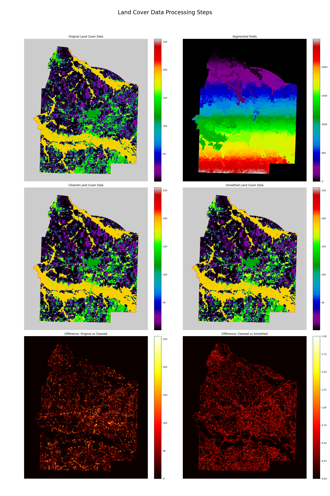

# Land Cover Data Processing for Haywood County, Tennessee

This repository contains a Python script for processing and analyzing land cover raster data for Haywood County, Tennessee, using 2023 data. The script performs the following tasks:
- Loads vector and raster data
- Identifies field boundaries using image segmentation
- Cleans the data by applying a majority filter
- Smooths the field boundaries
- Saves the processed raster data
- Visualizes the results to explain the changes at each step

## Background

Using spatial datasets found [here](https://croplandcros.scinet.usda.gov/), the objective is to process remote-sensed and classified field data. Landsat data is used to categorize land cover into specific crop categories. However, the categorization is unreliable in several areas. The main goal is to clean up these errors and create a readable spatial dataset.

### Area of Interest

The area of interest for this project is Haywood County, Tennessee.

## Requirements

To run the script, you need the following libraries:

- os
- logging
- geopandas
- rasterio
- numpy
- scipy
- matplotlib
- scikit-image

You can install these libraries using `pip`:

```sh
pip install geopandas rasterio numpy scipy matplotlib scikit-image
```

## Usage

### 1. Load Vector and Raster Data

The script starts by loading vector data (e.g., county boundaries) and raster data (land cover data). The vector data is loaded using `geopandas` and the raster data is loaded using `rasterio`.

### 2. Identify Field Boundaries

Field boundaries are identified using Felzenszwalb's efficient graph-based image segmentation method from the `skimage` library. The raster data is normalized to a 0-1 range before applying the segmentation.

### 3. Clean Field Data

The field data is cleaned by applying a majority filter within each segment. This means that within each segment identified in the previous step, the most common value is assigned to all pixels in that segment.

### 4. Smooth Boundaries

Gaussian smoothing is applied to the cleaned data to smooth the field boundaries. This is done using the `gaussian_filter` function from `scipy.ndimage`.

### 5. Save Processed Data

The processed raster data is saved to a file using `rasterio`.

### 6. Visualize Results

The script visualizes the original, segmented, cleaned, and smoothed data to explain the changes at each step. The visual comparison is saved as an image file.

## Visualization

To make the visualization more effective, the following enhancements are included:
- **Colorbars**: Added to each subplot to understand the range of values.
- **Titles**: Each subplot has a descriptive title, and an overall title is added to the figure.
- **Difference Images**: Two additional subplots show the differences between the original and cleaned data, and between the cleaned and smoothed data, using a "hot" colormap to highlight differences.

### Example Visualization

Below is an example of the visualized results:



## Running the Script

You can run the script using the command:

```sh
python analysis.py
```

Make sure your data files (`tl_rd22_47075_edges.shp` and `clipped.TIF`) are in the `data` directory.

## Conclusion

This script provides a complete workflow for processing land cover raster data, from loading and segmentation to cleaning, smoothing, and visualization. The visualization step is crucial for understanding the changes made at each processing stage.